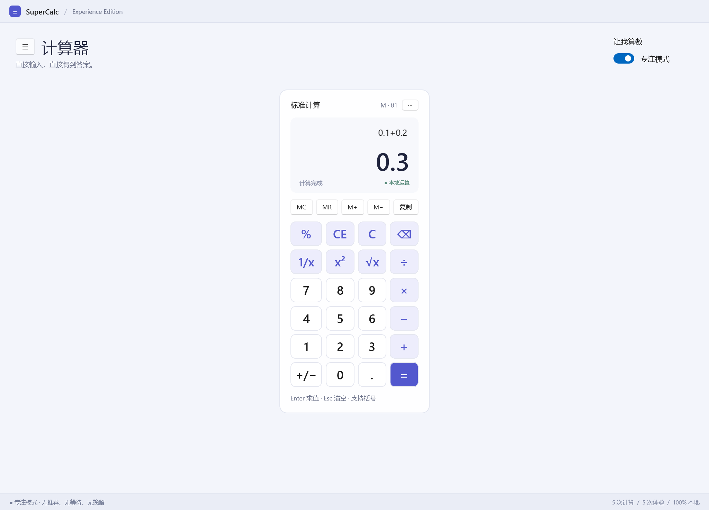

# SuperCalc

**为了计算，先体验。** A native WinUI 3 calculator and an affectionate, very inconvenient satire of over-designed system apps.

真正的计算器，过量的产品体验。Fluent 卡片、推荐内容、账号引导、AI 仪式、嵌套菜单、传统控制面板、更新和退出挽留，覆盖一次计算的整个生命周期。

独立讽刺作品，与 Microsoft 无关联。账号、订阅、云同步、AI 和更新均为本地模拟，不收费、不联网、不收集遥测。支持一键切换专注模式。


## 下载运行

每次推送 `main` 都会在 [Actions](https://github.com/CS-LX/SuperCalc/actions) 生成两种 ZIP；四段版本标签构建会发布到 [Releases](https://github.com/CS-LX/SuperCalc/releases)。完整解压后运行 `SuperCalc.App.exe`，不要只把 exe 单独拖出来。

- Windows 11 / Windows 10 2004（19041）及以上，x64。实际验证环境为 Windows 11 x64。
- `self-contained` 自包含包携带 .NET 与 Windows App SDK；`lightweight` 轻量包需要已安装 x64 .NET 8 Runtime 和兼容的 Windows App Runtime 1.8。下载链接见 [包使用说明](docs/release.md)。
- ZIP 文件名包含提交 SHA 的前 12 位，包内 `BUILD.txt` 记录完整 SHA，并附带 `SHA256SUMS.txt` 校验文件。
- 当前版本没有代码签名或安装器。
- 首次启动有三页向导；可以跳过，也可以在“设置”里重放。
- 右上角 **专注** 一键关闭推荐、求值等待与退出挽留。小窗口自动收起侧栏，原生导航可从左上角菜单打开。
- Mica 窗口、紧凑 NavigationView、固定计算键盘、历史 / CalcPilot 侧栏与系统主题色；按键回弹、结果过渡与错误反馈遵循系统和应用的动画偏好。

## 从打开到退出，没有一步白来

| 阶段 | 已实现的额外体验 |
| --- | --- |
| 启动 | 三页设置向导、账户归属感、推荐设置、稍后完成、本地虚构身份 |
| 首页 | 完成设置提示、推荐栏、会员入口、云盘入口、体验健康度 |
| 输入 | 推荐数字、个性化商业灵感、占用侧栏的 CalcPilot、三种答案语气、零积分深度思考 |
| 求值 | 准备工作空间、应用圆角、兼容性检查、结果推荐、每三次计算邀请反馈 |
| 复制 | 分享优先、“显示更多选项”、传统剪贴板属性、最终才复制 |
| 历史 | 侧栏最近记录、计算时间线、本地搜索之前的推荐、重新使用按钮 |
| 服务 | SuperCalc 365 虚构权益、OneNumber 假云端冲突、保留两个完全相同的 2 |
| 设置 | 原生设置卡片、个性化建议、相关设置、复古数字控制面板、无用兼容开关 |
| 更新 | KB000042、体验设置更新、99% 等待、安装后实际版本不变 |
| 退出 | 生产力旅程挽留、再体验一下、星级反馈、始终可用的直接退出 |

这些是可点击的交互，不只是画在界面上的文案。账号不要求邮箱或密码，订阅不收费，云端不联网，CalcPilot 使用本地模板。应用界面采用统一的产品口吻，作品背景与实现说明保留在仓库文档中。

## 真正的计算能力

- decimal 四则运算、运算优先级、括号、一元正负号、百分数、整数幂、平方根。
- 屏幕键盘和算式文本输入，Enter 求值、Esc 清空，支持 `* / -` 与 `× ÷ −`。
- `C` 清空；`CE` 清除末尾数字；退格尊重光标与选择范围。
- `MC / MR / M+ / M−` 记忆操作，结果复制、最近 100 条本地历史、搜索与重新使用。
- 明确处理除零、错误算式、溢出、过深嵌套和过长输入。
- 数值约 28–29 位有效数字；平方根使用浮点近似；幂指数范围为 -100 到 100 的整数。极小数可能舍入到零。
- **百分数是数学后缀**：`50% = 0.5`，`200 + 10% = 200.1`。增长 10% 请写 `200 × (1 + 10%)`。

设置、记忆与历史保存在 `%LOCALAPPDATA%\SuperCalc\state.json`，使用临时文件替换保存。不记录键盘遥测，不读取其他应用内容，不发出网络请求。



## 开发与验证

Windows + .NET 8 SDK（global.json 使用 8.0.4xx）。WinUI 3 / Windows App SDK 1.8，C# / XAML，原生桌面应用。

```powershell
# 运行核心测试，再构建 Release
./scripts/build.ps1

# 生成自包含 x64 发布目录
./scripts/build.ps1 -Publish

# 同时生成自包含 / 轻量 ZIP，文件名附加当前提交 SHA
./scripts/build.ps1 -Package

# 指定四段版本号（只打本地包，不创建标签或 Release）
./scripts/build.ps1 -Package -Version 1.2.3.4

# 单独运行核心测试
dotnet run --project tests/SuperCalc.Tests -c Release

# 隔离的应用内集成测试 + 原生 XAML 截图（启动窗口并自动关闭）
./scripts/smoke.ps1
```

测试报告见 [验证记录](docs/validation.md)。GitHub Actions 在 Windows runner 上测试并上传 `SuperCalc-win-x64-packages`，包含两个 ZIP 与校验文件。

发布时将 `vX.X.X.X` 标签推送到 GitHub，例如 `v1.2.3.4`。工作流验证标签指向的提交属于 `main` 历史，并从该标签提交构建、写入对应程序集版本，然后将两种 ZIP 与 SHA256 校验文件发布到同名 Release。非主分支提交、非四段数字或超出程序集版本范围的标签不会发布。普通主分支推送只生成 Actions 构建产物。

```text
src/SuperCalc.Core    有界十进制表达式解析器、历史与本地状态
src/SuperCalc.App     原生 WinUI 3 界面、讽刺流程与应用内冒烟测试
tests/SuperCalc.Tests 无测试框架依赖的数值与存储回归测试
docs                 调研、验证与实机 XAML 截图
```

[调研原始出处与设计映射](docs/design-research.md) · [原生布局调研与前后截图](docs/native-ui-review.md) · [MIT License](LICENSE)
