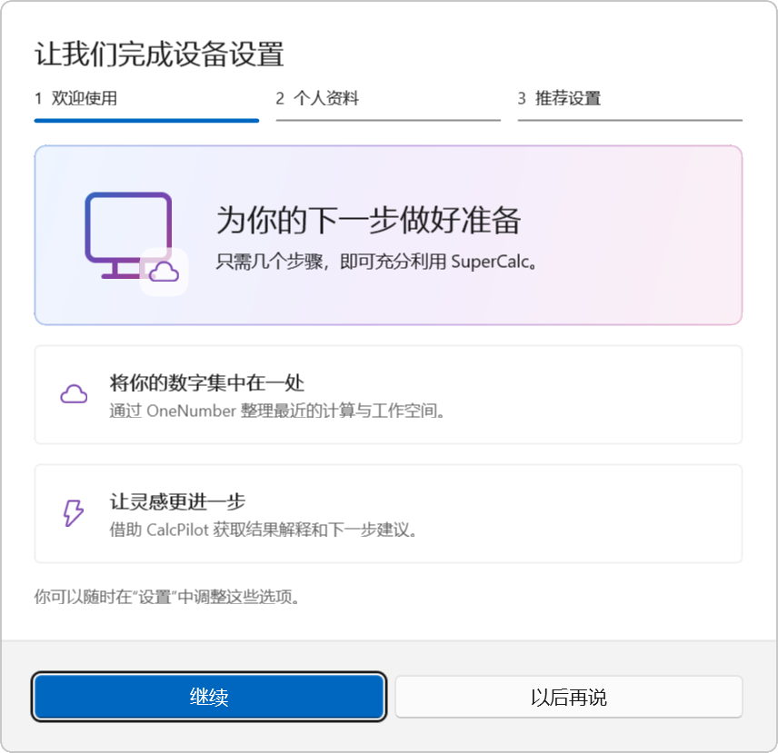
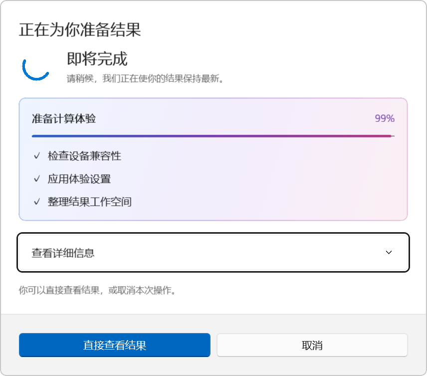
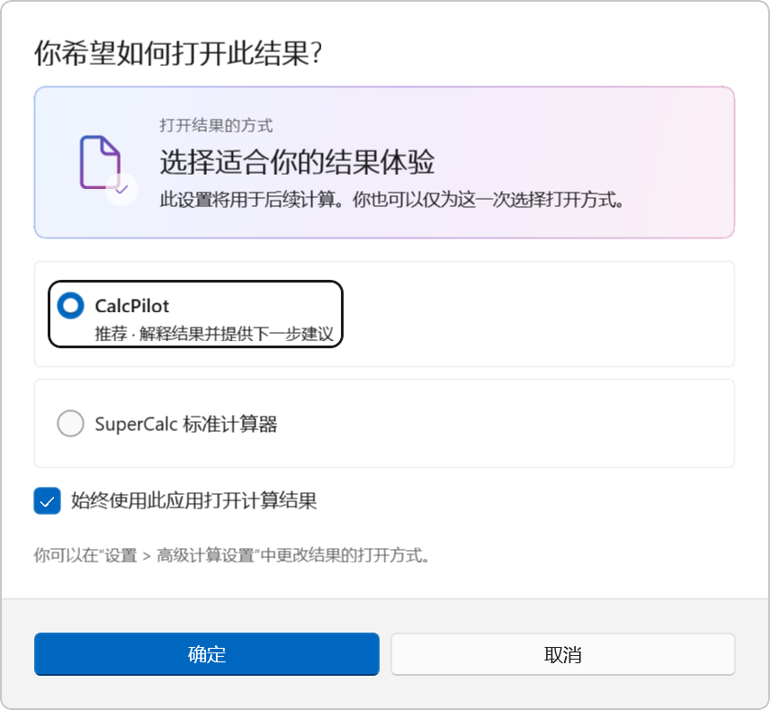

# 弹窗与计算体验

2026-09-21。原弹窗主要由标题、长段说明和按钮组成。本次参考 [微软 ContentDialog 指南](https://learn.microsoft.com/en-us/windows/apps/develop/ui/controls/dialogs-and-flyouts/dialogs)，保留原生弹窗外框、遮罩、焦点管理、Esc 关闭及固定按钮区，重新组织内容。Windows 的 [通知设置](https://support.microsoft.com/en-us/windows/experience/notifications-and-do-not-disturb-in-windows) 中关于完成设备设置和使用建议的体验，作为流程设计参考。

## 布局与动效

- 设置向导在同一弹窗内完成三步：欢迎、个人资料、推荐设置；有进度轨道、设备与云图示、选项卡片、前进与返回。
- 初始默认勾选来自已有偏好；最终确认才保存个人资料、推荐、增强计算与动画选项。关闭向导不会应用未确认的选择。
- 账户、分享、同步、更新等文字弹窗使用统一的图标引导区与内容分区。传统数字属性继续保持旧式外观。
- 使用原生弹窗开关动效，内容补充 160 ms 淡入和 200 ms 位移；向导切换时只过渡内容。自定义动效遵循 Windows 和应用动画设置。
- 深浅主题使用对应渐变色，弹窗宽度随窗口变化；窄窗口保留底部操作区。

## 新的额外流程

- 按下等号后，依次检查设备兼容性、应用体验设置、整理结果工作空间，进度经过 8%、42%、78%，在 99% 短暂停留后自动完成。可展开详细信息，也可直接查看结果或取消。
- 每三次计算，在尚未选择默认结果体验时出现“选择应用”引导：推荐 CalcPilot，提供“始终使用此应用打开计算结果”。偏好实际保存，可在高级计算设置修改。
- 每五次计算提示使用推荐设置；其他符合条件的第四次计算推荐 365 权益。提示可关闭，专注模式和关闭推荐会清除相关引导。
- 专注模式关闭上述额外流程。取消计算不写入历史；关闭增强体验或动画时跳过等待弹窗。
- 界面采用正式产品口吻，保留仓库层面的作品说明，不在界面透露实现方式。

## 验证

50 项核心测试、40 项应用集成检查通过。新增覆盖向导前进 / 返回 / 提交、取消勾选后设置同步、计算取消、直接查看、自动完成、99% 阶段取消、默认结果应用持久化。检查了浅色、深色与小窗口截图。

截图由实际加载的原生 XAML 生成，弹窗截图直接渲染其实际背景边框，不包含 Popup 的透明窗口区域。按钮测试通过进程内 WinUI AutomationPeer 调用真实处理流程；仍不是系统级鼠标注入测试。
