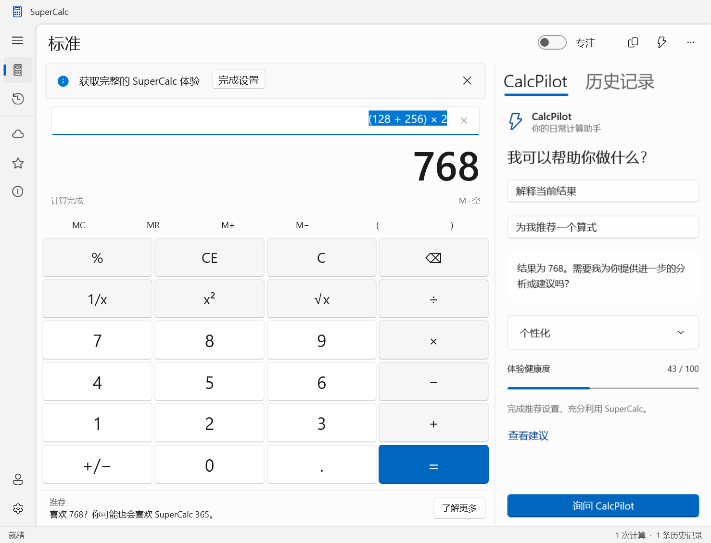
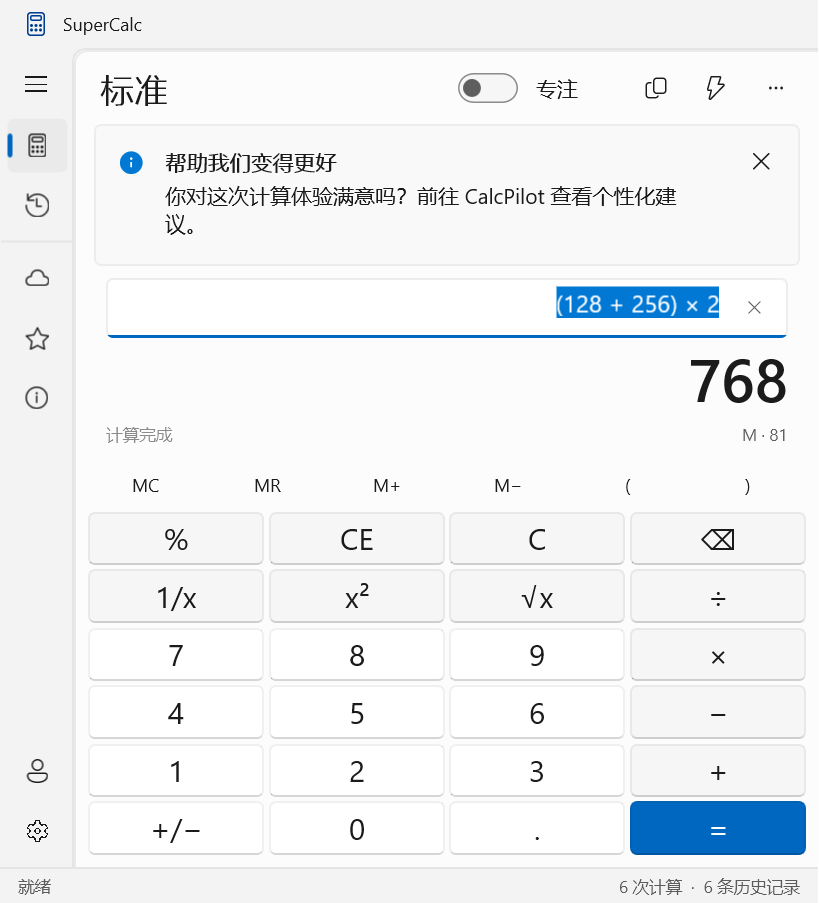
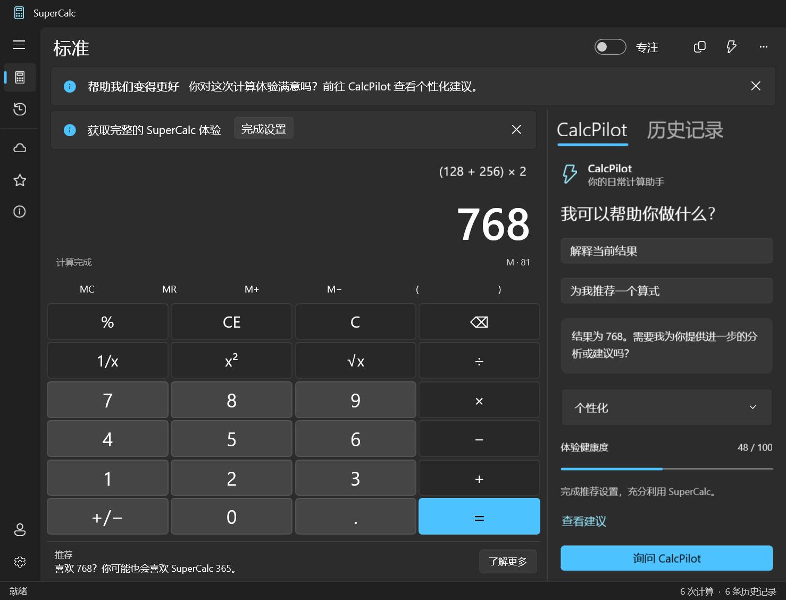

# 从网页式仪表盘到原生计算工作区

2026-09-20。先运行旧版本并重新截取原生 XAML，再对照微软的 WinUI 3 文档、WinUI Gallery，以及 Windows Calculator 的交互结构。Windows Calculator 是系统应用参照，不把它的 UWP 源码当成 WinUI 3 示例。

## 旧版本为什么像网页

旧版把整个内容区放进纵向 ScrollViewer。大标题、说明副标题、推广横幅、大圆角卡片、卡片内的计算器，以及右侧营销卡片，形成类似 SaaS 仪表盘的层级。窗口默认也过宽。主要操作键会随页面滚动，控件之间的空白多于桌面工具需要的空间。它使用了 WinUI 控件，但没有采用桌面应用的工作区结构。

## 参考与决策

| 参考 | 观察 | 本次调整 |
| --- | --- | --- |
| [微软 WinUI 3 应用结构](https://learn.microsoft.com/en-us/windows/apps/develop/ui/windows-app-sdk-app-structure) / [WinUI Gallery](https://github.com/microsoft/WinUI-Gallery) | 窗口框架、导航和内容层明确分工 | Mica 窗口、32 DIP 标题栏、原生 NavigationView 紧凑导航 |
| [NavigationView](https://learn.microsoft.com/en-us/windows/apps/develop/ui/controls/navigationview) | 原生导航提供选择指示、折叠与小尺寸适配 | 使用原生图标栏和弹出导航，不再手绘网站侧栏 |
| [Mica 与内容分层](https://learn.microsoft.com/en-us/windows/apps/design/style/mica) | 连续工作区和分段设置卡片是不同内容结构 | 计算器取消外层卡片；卡片只用于设置项，减小圆角和间距 |
| [Windows Calculator](https://github.com/microsoft/calculator) | 输入、结果、记忆与按键是主体；历史属于辅助操作 | 无整页滚动的键盘工作区，固定命令区，侧边历史 / CalcPilot 选项卡 |
| [微软 XAML 动画指南](https://learn.microsoft.com/en-us/windows/apps/develop/motion/xaml-animation) | 原生控件自带状态与过渡，补充动画应帮助识别变化 | 保留系统按钮、导航、Pivot、Expander 的原生反馈，再补充短动效 |

## 动效与反馈

- 数字键：70 ms 按下缩至 96.5%，140 ms 回弹；移出、取消或失去捕获时恢复。
- 页面 / 面板 / 结果 / 消息：10 DIP 位移配合 160–200 ms 淡入。
- 错误：220 ms、3 DIP 的轻微位移，配合原生错误 InfoBar。
- 成功操作：原生 Success InfoBar；处理中使用原生不确定进度条。
- 标题栏失活时减弱；主题颜色跟随系统，支持深浅主题。
- 自定义动效同时遵循应用动画开关与 Windows 的动画偏好，关闭开关会恢复正在动画的控件状态。

## 文案

界面中的“模拟 / 虚构 / 剧本 / 非真实 AI / 独立讽刺作品”等说明全部移除。设计博物馆替换成一本正经的“新增功能”；向导、账户、权益、分享、更新、反馈及退出对话框统一成产品口吻。实现仍然不使用网络账户、支付或外部 AI，作品背景保留在仓库说明中。

## 修改后

截图通过真实应用中的 RenderTargetBitmap 捕获。Mica 不属于 XAML 图层，因此截图临时使用对应主题的实体背景；实际窗口仍使用 MicaBackdrop。桌面自动化工具的 app-server 无法启动，未伪称完成系统级桌面截图或鼠标注入测试。
